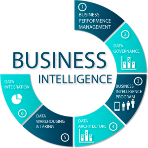

# Inteligencia de Negocios 

Este repositorio contiene información relacionada con inteligencia de negocios:

1. Conceptos Básicos de Inteligencia de Negocios
1. Modelo Dimensional (Modelo Estrella y Copo de Nieve)
1. Proceso de creación de ETL en SQL Integration Services
1. Automatización de los procesos de ETL
1. Visualización en Dashboard con Power BI 